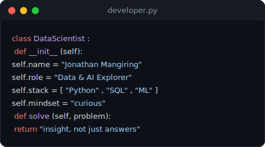
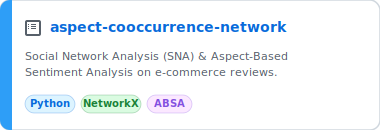
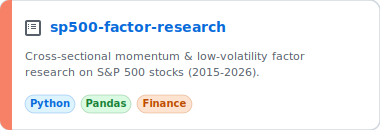

### Hi there, I'm Jonathan Mangiring 👋

*Data Science & AI Enthusiast · Turning Data into Decisions*

<!-- About Me & Code Section -->
<table align="center" border="0" cellpadding="0" cellspacing="0" width="100%">
<tr>
<td width="55%" valign="top" style="border: none;">

### 🧠 About Me

I'm **Jonathan Mangiring** (*Nathann*), a Data Science & AI enthusiast who enjoys turning messy data into clear insight. I like exploring datasets, building models, and understanding *why* the numbers say what they say - not just *what* they say.

* 🔭 Currently working on **Social Network Analysis (SNA) & Aspect-Based Sentiment Analysis (ABSA)** on e-commerce reviews.
* 📈 Also diving into **quantitative factor research** - momentum & low-volatility strategies on the S&P 500.
* 💬 Ask me about **Python, NLP, network analysis, or quant finance**.
* ⚡ Fun fact: I think a clean dataset is more satisfying than a clean desk.

</td>
<td width="45%" valign="top" align="center" style="border: none;">

</td>
</tr>
</table>

 

### 🛠️ Tech Stack

**Languages & Databases**
 

  

**Data Science & Machine Learning**
 

  

**Tools & Environment**
 

 

### 📌 Featured Projects

  
  

 

### 📊 GitHub Stats

  

 

### 🤝 Let's Connect

  
  

 

  ✨ Thanks for stopping by - feel free to explore my repositories!

